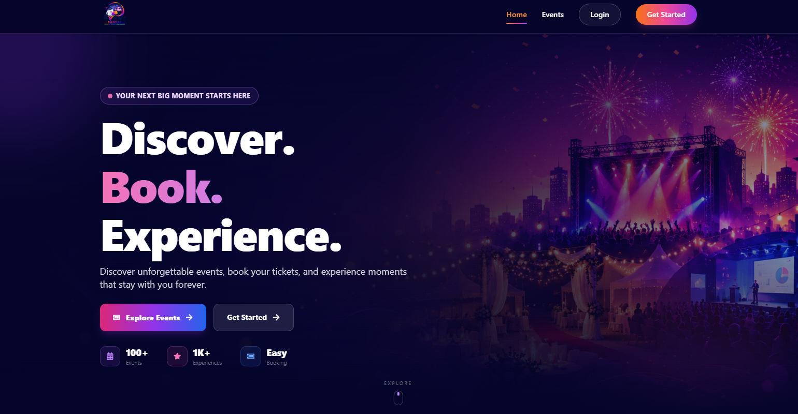
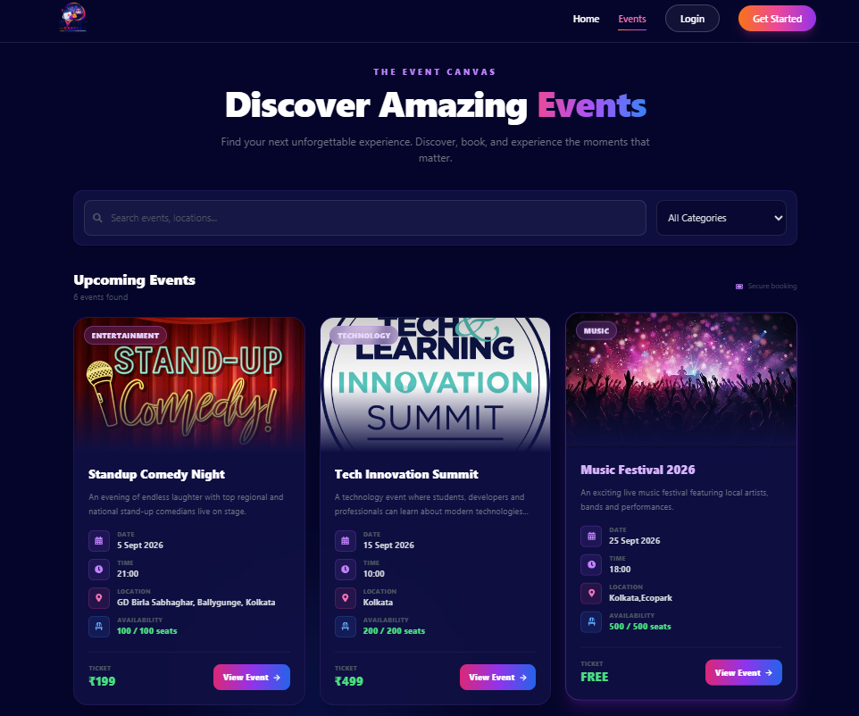
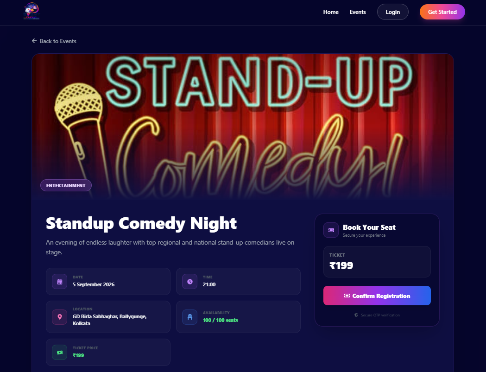
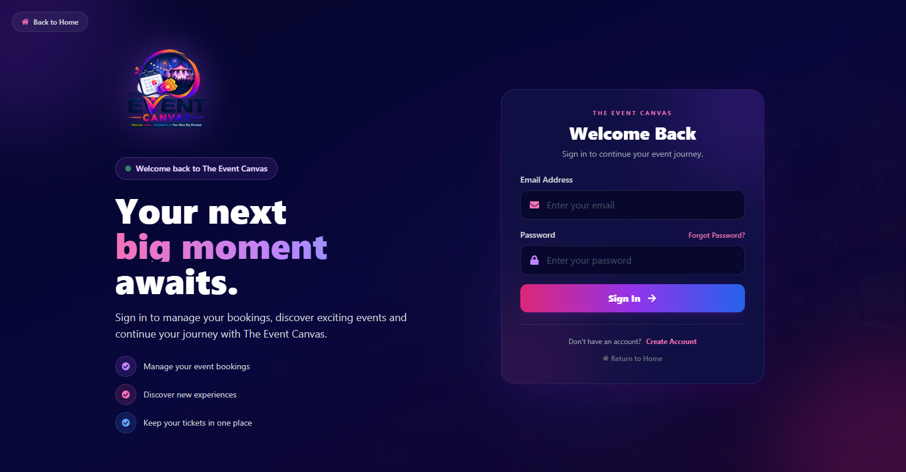
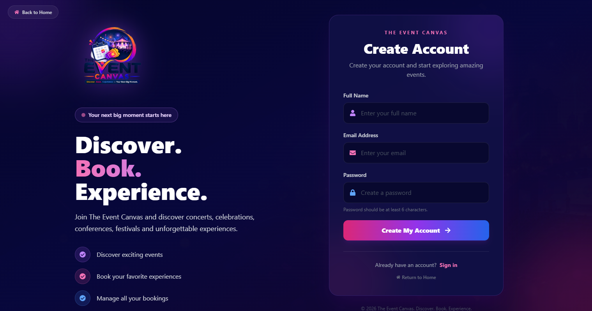

<div align="center">

# 🎟️ The Event Canvas

### Discover. Book. Experience — Your Next Big Moment.

A full-stack **MERN event discovery, creation, approval, and booking platform** where users can discover events, create events for admin approval, book available seats, and receive tickets.

<br>


<br><br>

[📂 GitHub Repository](https://github.com/Aniruddha-Porey/The-Event-Canvas)

</div>

---

# 🌟 Overview

**The Event Canvas** is a full-stack event management and booking platform built using the **MERN stack**.

The platform provides two main experiences:

* 👤 **Users** can discover events, create events for admin approval, book available events, make payments for paid events, and receive tickets.
* 🛠️ **Admins** can create and publish events directly, approve or reject user-created events, manage bookings, and delete events whenever required.

The system also handles **seat availability**, **free and paid events**, **booking status**, **payment status**, and **ticket generation**.

---

# 🖥️ Screenshots

## 🏠 Homepage

<p align="center">
  
</p>

The homepage provides the main entry point to the platform and allows users to explore the event experience.

---

## 🔎 Explore Events

<p align="center">
  
</p>

Users can browse available published events and discover events they may want to attend.

---

## 🎟️ Event Details

<p align="center">
  
</p>

The event details page provides information about an event before the user proceeds with booking.

---

## 🔐 Login

<p align="center">
  
</p>

Users can securely log in to access their account, bookings, and event-related features.

---

## 📝 Create Account

<p align="center">
  
</p>

New users can create an account before accessing protected platform features.

---

# ✨ Key Features

<table>
<tr>
<td width="50%">

## 👤 User Features

* User registration
* Secure login
* JWT authentication
* Password hashing
* OTP verification
* Browse published events
* View event details
* Check seat availability
* Create new events
* Submit events for admin approval
* Book free events
* Book paid events
* Payment processing
* Ticket generation
* Booking history
* Booking status tracking

</td>

<td width="50%">

## 🛠️ Admin Features

* Admin authentication
* Admin dashboard
* Review user-created events
* Approve events
* Reject events
* Create events directly
* Publish events directly
* Monitor event availability
* Manage bookings
* Manage booking status
* Monitor payment status
* Delete any event at any time
* Manage platform content

</td>
</tr>
</table>

---

# 🎯 Event Creation System

The Event Canvas supports **two different event creation workflows**.

## 👤 User-Created Event

Users can create their own events, but those events do not become publicly available immediately.

```text
User
  │
  ▼
Create Event
  │
  ▼
Submit for Approval
  │
  ▼
Admin Review
  │
  ├───────────────┐
  │               │
  ▼               ▼
Approve          Reject
  │               │
  ▼               ▼
Published       Not Published
  │
  ▼
Available for Booking
```

This provides administrative control over user-submitted events.

---

## 🛠️ Admin-Created Event

Administrators can create and publish events directly.

```text
Admin
  │
  ▼
Create Event
  │
  ▼
Publish Directly
  │
  ▼
Available for Booking
```

Admin-created events do not require an additional approval step.

---

# 🎟️ Booking System

The booking system checks **seat availability** before allowing a booking.

```text
User
  │
  ▼
Select Event
  │
  ▼
Check Available Seats
  │
  ├──────────────────┐
  │                  │
  ▼                  ▼
Seats Available    No Seats
  │                  │
  ▼                  ▼
Continue Booking   Booking Unavailable
```

If there are no available seats, the user cannot complete the booking.

---

# 🆓 Free Event Booking

For a free event:

```text
User
  │
  ▼
Select Free Event
  │
  ▼
Check Seat Availability
  │
  ▼
Seat Available
  │
  ▼
Confirm Booking
  │
  ▼
🎟️ Ticket Generated
```

Users do not need to make a payment for free events.

---

# 💳 Paid Event Booking

For paid events:

```text
User
  │
  ▼
Select Paid Event
  │
  ▼
Check Seat Availability
  │
  ├────────────────────┐
  │                    │
  ▼                    ▼
Seat Available       No Seat
  │                    │
  ▼                    ▼
Proceed to Payment   Booking Unavailable
  │
  ├──────────────────┐
  │                  │
  ▼                  ▼
Payment Success    Payment Failed
  │                  │
  ▼                  ▼
🎟️ Ticket          Booking Not
Generated          Completed
```

A paid-event ticket is issued only after the required payment is successfully completed.

---

# 🎫 Ticket System

The platform provides ticket generation based on the type of event.

| Event Type | Seat Available | Payment        | Result                |
| ---------- | -------------- | -------------- | --------------------- |
| 🆓 Free    | ✅              | Not required   | 🎟️ Ticket            |
| 🆓 Free    | ❌              | Not required   | Booking unavailable   |
| 💳 Paid    | ✅              | ✅ Successful   | 🎟️ Ticket            |
| 💳 Paid    | ✅              | ❌ Failed       | Booking not completed |
| 💳 Paid    | ❌              | Not applicable | Booking unavailable   |

---

# 👨‍💼 Admin Control

Administrators have complete control over event management.

### Admin can:

* ✅ Create events
* ✅ Publish events directly
* ✅ Approve user-created events
* ✅ Reject user-created events
* ✅ Manage published events
* ✅ Monitor available seats
* ✅ Manage bookings
* ✅ Review booking and payment status
* ✅ Delete any event at any time

This provides a centralized moderation and management system for the platform.

---

# 🔄 Complete Application Flow

```text
                         THE EVENT CANVAS
                                │
                 ┌──────────────┴──────────────┐
                 │                             │
                USER                          ADMIN
                 │                             │
        ┌────────┴─────────┐          ┌────────┴────────┐
        │                  │          │                 │
   Create Event       Browse Events  Create Event   Review Events
        │                  │          │                 │
        ▼                  │          ▼                 │
 Admin Approval             │     Publish Directly      │
        │                  │          │                 │
   ┌────┴────┐             │          │          Approve / Reject
   │         │             │          │                 │
Approved   Rejected         │          └────────┬────────┘
   │         │             │                   │
   ▼         │             └──────────┬────────┘
Published    │                        │
   │         │                        ▼
   │         └──────────────► Published Events
   │                                  │
   └──────────────────────────────────┤
                                      ▼
                                   Booking
                                      │
                                      ▼
                              Check Seat Availability
                                      │
                              ┌───────┴────────┐
                              │                │
                           Available        No Seats
                              │                │
                       ┌──────┴──────┐         │
                       │             │         ▼
                     FREE           PAID    Unavailable
                       │             │
                       ▼             ▼
                    Booking       Payment
                       │             │
                       │       ┌─────┴─────┐
                       │       │           │
                       │    Success      Failed
                       │       │           │
                       └───┬───┘           │
                           ▼               │
                       🎟️ Ticket           │
                                           ▼
                                   Booking Not Completed
```

---

# 🏗️ System Architecture

```text
┌───────────────────────────────────────────────┐
│                  FRONTEND                     │
│                                               │
│              React + Vite                     │
│                                               │
│  Home │ Events │ Details │ Login │ Dashboard │
└───────────────────────┬───────────────────────┘
                        │
                        │ REST API
                        ▼
┌───────────────────────────────────────────────┐
│                   BACKEND                     │
│                                               │
│            Node.js + Express.js                │
│                                               │
│ Authentication │ Events │ Bookings │ Payments │
└───────────────────────┬───────────────────────┘
                        │
                        ▼
┌───────────────────────────────────────────────┐
│                  DATABASE                     │
│                                               │
│                    MongoDB                    │
│                                               │
│ Users │ Events │ Bookings │ Payment Status    │
└───────────────────────────────────────────────┘
```

---

# 🛠️ Tech Stack

## Frontend

| Technology      | Purpose                    |
| --------------- | -------------------------- |
| ⚛️ React.js     | User interface             |
| ⚡ Vite          | Development and build tool |
| 🎨 CSS          | Styling                    |
| 🧭 React Router | Client-side navigation     |

## Backend

| Technology    | Purpose             |
| ------------- | ------------------- |
| 🟢 Node.js    | Server-side runtime |
| 🚂 Express.js | REST API            |
| 🍃 MongoDB    | Database            |
| 📦 Mongoose   | Database modeling   |

## Authentication & Services

| Technology    | Purpose                     |
| ------------- | --------------------------- |
| 🔐 JWT        | Authentication              |
| 🔒 bcrypt.js  | Password hashing            |
| 📧 Nodemailer | Email and OTP functionality |

---

# 📁 Project Structure

```text
TheEventCanvas/
│
├── client/
│   ├── public/
│   ├── src/
│   │   ├── assets/
│   │   ├── components/
│   │   ├── pages/
│   │   └── ...
│   └── package.json
│
├── server/
│   ├── controllers/
│   ├── models/
│   ├── routes/
│   ├── middleware/
│   ├── server.js
│   └── package.json
│
├── screenshots/
│   ├── Homepage.png
│   ├── explore.png
│   ├── Event_details.png
│   ├── login.png
│   └── Create_account.png
│
├── .gitignore
├── package-lock.json
└── README.md
```

---

# 🚀 Getting Started

## 1. Clone the Repository

```bash
git clone https://github.com/Aniruddha-Porey/The-Event-Canvas.git
cd The-Event-Canvas
```

## 2. Install Frontend Dependencies

```bash
cd client
npm install
```

## 3. Install Backend Dependencies

```bash
cd ../server
npm install
```

---

# ⚙️ Environment Variables

Create a `.env` file inside the `server` directory.

```env
PORT=5000
MONGODB_URI=your_mongodb_connection_string
JWT_SECRET=your_jwt_secret
EMAIL_USER=your_email
EMAIL_PASS=your_email_password
```

> ⚠️ **Never upload your actual `.env` file or credentials to GitHub.**

---

# ▶️ Run the Application

## Start Backend

```bash
cd server
npm run dev
```

Backend:

```text
http://localhost:5000
```

## Start Frontend

Open another terminal:

```bash
cd client
npm run dev
```

Frontend:

```text
http://localhost:5173
```

---

# 🔐 Security

The application includes:

* JWT-based authentication
* Password hashing using bcrypt
* Protected routes
* Role-based authorization
* OTP verification
* Environment-based configuration
* Admin-controlled event approval

---

# 📚 What I Learned

Building **The Event Canvas** helped me gain practical experience in:

* Full-stack MERN development
* React component architecture
* REST API development
* MongoDB and Mongoose
* Authentication and authorization
* JWT implementation
* Password security
* OTP verification
* Email integration
* Event management
* Booking management
* Seat availability handling
* Free and paid event workflows
* Ticket generation
* Admin approval systems
* Frontend-backend integration
* Git and GitHub

---

# 🔮 Future Improvements

* 💳 Production payment gateway integration
* 🎫 QR-code based digital tickets
* 🔎 Advanced event search and filtering
* ⭐ Event reviews and ratings
* 📧 Automated booking confirmation emails
* 📱 Improved mobile experience
* ⚡ Real-time seat availability
* 📊 Advanced admin analytics
* ☁️ Cloud deployment
* 🔔 Event and booking notifications

---

# 👨‍💻 Author

<div align="center">

## Aniruddha Porey

**B.Tech — Computer Science & Engineering**

**Narula Institute of Technology**

<br>

`Web Development` • `MERN Stack` • `Programming` • `Cloud Computing`

<br>

[](https://github.com/Aniruddha-Porey)

</div>

---

<div align="center">

## ⭐ The Event Canvas

### Discover. Book. Experience.

If you find this project interesting, consider giving the repository a ⭐

</div>
